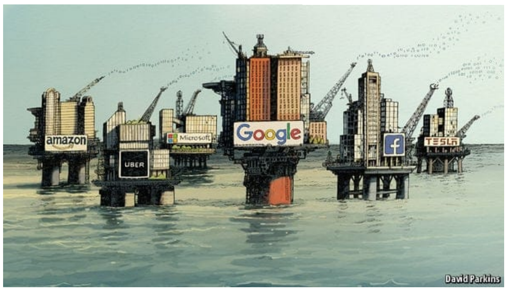
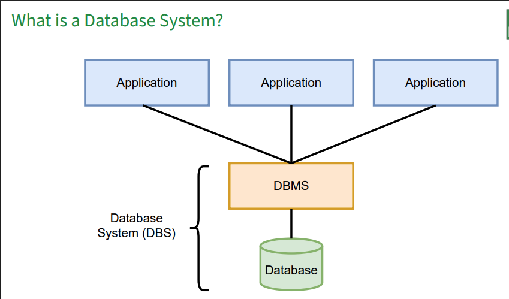

# Daten_Bank_Systeme

What is a Database System?
 – It is a system for storing and managing data
 – A Database System (DBS) consists of a Database (DB) and a Database Management
System (DBMS)

Database
 – A (typically very large) integrated collection of interrelated data which are stored in files
 – Data describe information and activities about one or more related organizations
(portion of the real world)
 – For example, a university database might contain information about
 – entities (e.g., students, courses, faculties, ...)
 – relationships among entities (e.g., ’Bill is taking the Database Systems course’)
 Database Management System
 – A collection of software packages designed to store, access, and manage databases

